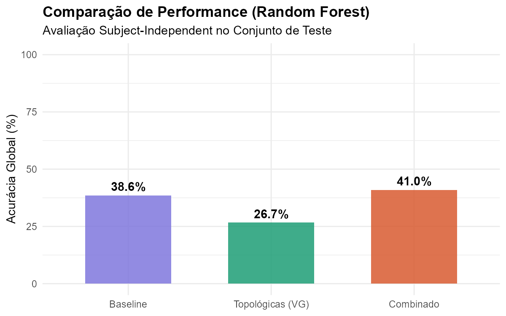
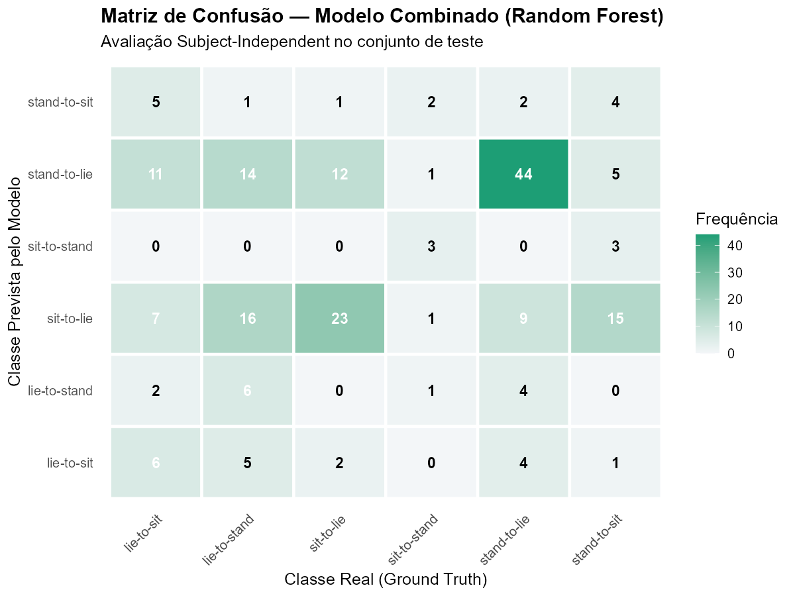

# 🧬 BIO-SIS — Classificação de Transições Posturais via Visibility Graphs

> Sistema de Bioinformática para reconhecimento de atividades humanas a partir de sinais inerciais (IMU), utilizando **Natural Visibility Graphs (NVG)** como representação topológica do sinal e **Random Forest** como classificador.

---

## 📋 Índice

- [Visão Geral](#visão-geral)
- [Dataset](#dataset)
- [Arquitetura do Pipeline](#arquitetura-do-pipeline)
- [Etapas do Pipeline](#etapas-do-pipeline)
- [Resultados](#resultados)
- [Estrutura do Projeto](#estrutura-do-projeto)
- [Como Executar](#como-executar)
- [Dependências](#dependências)
- [Referências](#referências)
- [Declaração de Uso de IA](#-declaração-de-uso-de-inteligência-artificial)

---

## 🔬 Visão Geral

Este projeto implementa um pipeline completo de análise de sinais biomecânicos para **classificação de transições posturais** (ex.: sentar-se, levantar-se, deitar-se) capturadas por sensores inerciais de smartphones.

A abordagem principal é a transformação de séries temporais de aceleração em **grafos de visibilidade (Visibility Graphs)**, extraindo propriedades topológicas da rede resultante como features para um classificador Random Forest. Essa metodologia permite capturar padrões estruturais do sinal que abordagens estatísticas clássicas (média, desvio padrão, RMS) podem não revelar.

### Motivação

Transições posturais são atividades breves e dinâmicas — muito mais difíceis de classificar que atividades estáticas (caminhar, sentar, ficar em pé). A hipótese central é que a **topologia do grafo de visibilidade** revela assinaturas distintas para cada tipo de transição, potencialmente melhorando a discriminação entre movimentos semelhantes.

---

## 📊 Dataset

**UCI HAPT** — _Smartphone-Based Recognition of Human Activities and Postural Transitions_

| Propriedade                  | Valor                                                                      |
| ---------------------------- | -------------------------------------------------------------------------- |
| **Fonte**                    | [UCI Machine Learning Repository](https://archive.ics.uci.edu/dataset/341) |
| **Sensores**                 | Acelerômetro + Giroscópio (Samsung Galaxy S II)                            |
| **Frequência de Amostragem** | 50 Hz                                                                      |
| **Sujeitos**                 | 30 voluntários (19–48 anos)                                                |
| **Atividades de Interesse**  | 6 transições posturais                                                     |

### Atividades Analisadas

| ID  | Transição   |
| --- | ----------- |
| 7   | Stand → Sit |
| 8   | Sit → Stand |
| 9   | Sit → Lie   |
| 10  | Lie → Sit   |
| 11  | Stand → Lie |
| 12  | Lie → Stand |

---

## 🏗️ Arquitetura do Pipeline

```
┌─────────────────┐    ┌──────────────────┐    ┌─────────────────┐
│  01_preprocessing│───▶│ 02_visibility_   │───▶│  03_features    │
│  .R              │    │ graph.R          │    │  .R             │
│                  │    │                  │    │                 │
│ • Download HAPT  │    │ • NVG/HVG        │    │ • Grau médio    │
│ • Filtro Butter. │    │ • Z-score norm.  │    │ • Clustering    │
│ • Janelamento    │    │ • Metadados      │    │ • Entropia      │
│ • Segmentação    │    │                  │    │ • Small-world   │
└─────────────────┘    └──────────────────┘    └────────┬────────┘
                                                        │
                       ┌──────────────────┐             │
                       │  04_baseline.R   │             │
                       │                  │             │
                       │ • RMS, SD, IQR   │             │
                       │ • Entropia sinal │             │
                       │ • Zero-crossing  │             │
                       └────────┬─────────┘             │
                                │                       │
                                ▼                       ▼
                       ┌──────────────────────────────────┐
                       │       05_classification.R        │
                       │                                  │
                       │ • Modelo A: Baseline clássico    │
                       │ • Modelo B: Features topológicas │
                       │ • Modelo C: Combinado (A + B)    │
                       │ • Avaliação Subject-Independent  │
                       └──────────────────────────────────┘
```

---

## 📝 Etapas do Pipeline

### Etapa 1 — Pré-Processamento (`01_preprocessing.R`)

- **Download automático** do dataset UCI HAPT
- **Leitura** de sinais brutos (acelerômetro 3-eixos + giroscópio 3-eixos)
- **Filtro Butterworth** passa-banda (0.3–20 Hz, ordem 4) para remover componente gravitacional e ruído de alta frequência
- **Segmentação** por atividade com base nos rótulos
- **Janelamento** com sobreposição de 70% (janelas de 2.56s = 128 amostras a 50 Hz)
- **Cálculo de magnitudes** escalares (`acc_mag`, `gyro_mag`)

### Etapa 2 — Visibility Graphs (`02_visibility_graph.R`)

- Implementação do **Natural Visibility Graph (NVG)** — Lacasa et al., PNAS 2008
- Implementação do **Horizontal Visibility Graph (HVG)** como alternativa
- **Normalização Z-score** do sinal por janela antes da construção do grafo
- Geração de objetos `igraph` com metadados (atividade, sujeito, experimento)
- Versão vetorizada (`nvg_fast`) para performance otimizada (~0.05s/grafo)

### Etapa 3 — Features Topológicas (`03_features.R`)

Para cada grafo, são extraídas **16 features topológicas**:

| Categoria                | Features                                                     |
| ------------------------ | ------------------------------------------------------------ |
| **Distribuição de Grau** | `mean_degree`, `sd_degree`, `max_degree`, `degree_exponent`  |
| **Conectividade**        | `density`, `clustering_coef`, `mean_path_length`, `diameter` |
| **Centralidade**         | `mean_betweenness`, `max_betweenness`, `mean_closeness`      |
| **Complexidade**         | `degree_entropy`, `modularity`, `sw_index` (small-world)     |

### Etapa 4 — Baseline Clássico (`04_baseline.R`)

Features estatísticas do domínio do tempo (14 features):

| Sensor           | Features                                                             |
| ---------------- | -------------------------------------------------------------------- |
| **Acelerômetro** | `mean`, `sd`, `median`, `iqr`, `max`, `min`, `rms`, `entropy`, `zcr` |
| **Giroscópio**   | `mean`, `sd`, `rms`, `entropy`, `zcr`                                |

### Etapa 5 — Classificação (`05_classification.R`)

- **Divisão Subject-Independent** (70/30) — nenhum sujeito aparece em treino e teste
- **3 modelos Random Forest** (300 árvores cada):
  - **Modelo A**: Apenas features clássicas (baseline)
  - **Modelo B**: Apenas features topológicas (VG)
  - **Modelo C**: Combinação de ambos
- **Avaliação**: Acurácia, Kappa, Matriz de Confusão

---

## 📈 Resultados

### Comparação de Desempenho (Subject-Independent)

Métricas globais no conjunto de teste (9 sujeitos, 210 janelas). Precision, Recall
e F1 são a **média macro** entre as 6 classes de transição.

| Modelo              | Features                  | Acurácia  | Kappa     | Precision | Recall    | F1        |
| ------------------- | ------------------------- | --------- | --------- | --------- | --------- | --------- |
| **A — Baseline**    | 14 estatísticas clássicas | 38.6%     | 0.208     | 0.388     | 0.343     | 0.330     |
| **B — Topológicas** | 16 features de rede       | 26.7%     | 0.070     | 0.201     | 0.199     | 0.225     |
| **C — Combinado**   | 30 features (A + B)       | **41.0%** | **0.242** | **0.399** | **0.360** | **0.348** |

> Dataset combinado: **752 janelas** (21 sujeitos em treino, 9 em teste).
> Semente fixa (`set.seed(42)` para a divisão, `set.seed(123)` para o treino) —
> os valores acima são reproduzíveis rodando `R/05_classification.R`.



### Matriz de Confusão (Modelo Combinado)



### Observações

- O **Modelo Combinado (C)** venceu em **todas** as métricas, indicando que as features topológicas **complementam** as clássicas em vez de substituí-las (Acurácia +2.4 p.p. e Kappa +0.034 sobre o baseline).
- O **Modelo B (topológicas puras)** teve o pior desempenho isolado (Kappa 0.070, próximo do acaso), pois a normalização Z-score por janela descarta a escala física de amplitude do sinal.
- A tarefa é intrinsicamente difícil: 6 classes de transições muito breves (< 2 s) e semelhantes entre si, sob validação **Subject-Independent** — mais rigorosa e realista que cenários subject-dependent.
- A feature topológica **modularity** aparece entre as Top 15 mais importantes (Mean Decrease Gini) no modelo combinado.
- Features clássicas do **giroscópio** (`gyro_mean`, `gyro_rms`, `gyro_sd`) dominam o ranking de importância.

---

## 📂 Estrutura do Projeto

```
bio_sis/
├── R/                              # Scripts R do pipeline
│   ├── 01_preprocessing.R          # Download, filtro, segmentação
│   ├── 02_visibility_graph.R       # Construção dos NVG/HVG
│   ├── 03_features.R               # Extração de features topológicas
│   ├── 04_baseline.R               # Extração de features estatísticas
│   ├── 05_classification.R         # Treinamento e avaliação (Random Forest)
│   └── views/                      # Scripts de visualização auxiliares
│       ├── 01_view.R               # Sinal no domínio do tempo
│       ├── 02_view.R               # Visualização do NVG
│       ├── 03_view.R               # Assinatura topológica
│       └── 05_view.R               # Matriz de confusão
│
├── data/                           # Dados brutos (UCI HAPT)
│   ├── hapt.zip                    # Dataset compactado
│   └── HAPT/                       # Dataset extraído
│       ├── RawData/                # Sinais brutos (acc/gyro)
│       ├── Train/                  # Partição oficial de treino
│       ├── Test/                   # Partição oficial de teste
│       └── activity_labels.txt     # Dicionário de atividades
│
├── output/                         # Resultados gerados
│   ├── windows_preprocessed.rds    # Janelas de sinal filtradas
│   ├── graphs_nvg_acc_mag.rds      # Grafos NVG (magnitude acelerômetro)
│   ├── features_topological.rds    # Features topológicas (RDS)
│   ├── features_topological.csv    # Features topológicas (CSV)
│   ├── features_baseline.rds       # Features clássicas (RDS)
│   ├── features_baseline.csv       # Features clássicas (CSV)
│   └── figures/                    # Gráficos gerados
│       ├── fig1_mean_degree.png
│       ├── fig2_smallworld.png
│       ├── fig3_entropy.png
│       ├── fig4_baseline_rms.png
│       ├── fig5_baseline_scatter.png
│       ├── fig6_accuracy_comparison.png
│       ├── fig7_variable_importance.png
│       └── fig8_confusion_matrix.png
│
├── analysis.html                   # Página de análise interativa
└── README.md                       # Este arquivo
```

---

## 🚀 Como Executar

### Pré-requisitos

- **R** ≥ 4.0
- Conexão com a internet (para download automático do dataset)

### Execução Sequencial

```r
# Execute os scripts na ordem:
source("R/01_preprocessing.R")      # ~2-5 min (inclui download)
source("R/02_visibility_graph.R")   # ~5-15 min (CPU-intensive)
source("R/03_features.R")           # ~1-3 min
source("R/04_baseline.R")           # ~10 seg
source("R/05_classification.R")     # ~30 seg
```

> ⚠️ Os pacotes necessários são instalados automaticamente por cada script quando não encontrados.

### Visualizações Individuais

```r
# Para gerar gráficos individuais:
source("R/views/01_view.R")   # Sinal no domínio do tempo
source("R/views/02_view.R")   # Visibility Graph visual
source("R/views/03_view.R")   # Assinatura topológica
source("R/views/05_view.R")   # Matriz de confusão
```

---

## 📦 Dependências

| Pacote         | Versão Mín. | Uso                                    |
| -------------- | ----------- | -------------------------------------- |
| `signal`       | 0.7         | Filtro Butterworth (passa-banda)       |
| `dplyr`        | 1.0         | Manipulação e agregação de dados       |
| `readr`        | 2.0         | Leitura de arquivos texto              |
| `igraph`       | 1.3         | Construção e análise de grafos         |
| `tibble`       | 3.0         | Data frames modernos                   |
| `randomForest` | 4.7         | Classificador Random Forest            |
| `caret`        | 6.0         | Avaliação de modelos (confusionMatrix) |
| `ggplot2`      | 3.4         | Geração de gráficos                    |
| `tidyr`        | 1.3         | Reestruturação de dados                |

---

## 📚 Referências

1. **Lacasa, L. et al.** (2008). From time series to complex networks: The visibility graph. _Proceedings of the National Academy of Sciences_, 105(13), 4972-4975. DOI: [10.1073/pnas.0709247105](https://doi.org/10.1073/pnas.0709247105)

2. **Reyes-Ortiz, J. L. et al.** (2016). Transition-aware human activity recognition using smartphones. _Neurocomputing_, 171, 754-767. DOI: [10.1016/j.neucom.2015.07.085](https://doi.org/10.1016/j.neucom.2015.07.085)

3. **UCI Machine Learning Repository** — [Smartphone-Based Recognition of Human Activities and Postural Transitions](https://archive.ics.uci.edu/dataset/341)

---

## 🤖 Declaração de Uso de Inteligência Artificial

Em conformidade com as diretrizes de transparência acadêmica, declaramos o uso de
ferramentas de IA generativa durante o desenvolvimento deste trabalho.

| Item                   | Descrição                                                                                                                                                           |
| ---------------------- | ------------------------------------------------------------------------------------------------------------------------------------------------------------------- |
| **Ferramenta(s)**      | Claude Code (Anthropic) — assistente de IA para engenharia de software                                                                                              |
| **Finalidade**         | Apoio à redação e revisão do relatório técnico (README + `index.html`), alinhamento do texto aos resultados reais e organização da estrutura em 6 seções            |
| **Partes do trabalho** | Redação/revisão textual, padronização das tabelas de métricas, geração da figura de matriz de confusão e verificação de consistência entre o código R e o relatório |

**Como foi utilizada:** a IA atuou como assistente de redação e revisão, sob
supervisão humana. Todos os resultados numéricos foram **produzidos pela execução
dos scripts R** deste repositório e conferidos manualmente; a IA não gerou dados
nem métricas. A concepção metodológica (uso de Visibility Graphs, escolha do
dataset e desenho experimental) é de autoria do pesquisador.

**Prompts representativos utilizados:**

- _"Preciso de ideias para transofrmar dados de sensores inerciais, acelerometro e giroscopio em redes topologicas."_
- _"Como que posso fazer para extrair mais informacoes do classificador?"_
- _"Analise o resultado do meu projeto e ajude a melhorar o meu artigo, alinhando os resultados reais a estrutura ja predefinida."_

---

## 📄 Licença

Este projeto é de uso acadêmico. O dataset HAPT é disponibilizado sob a licença CC BY 4.0 pelo UCI Machine Learning Repository.
